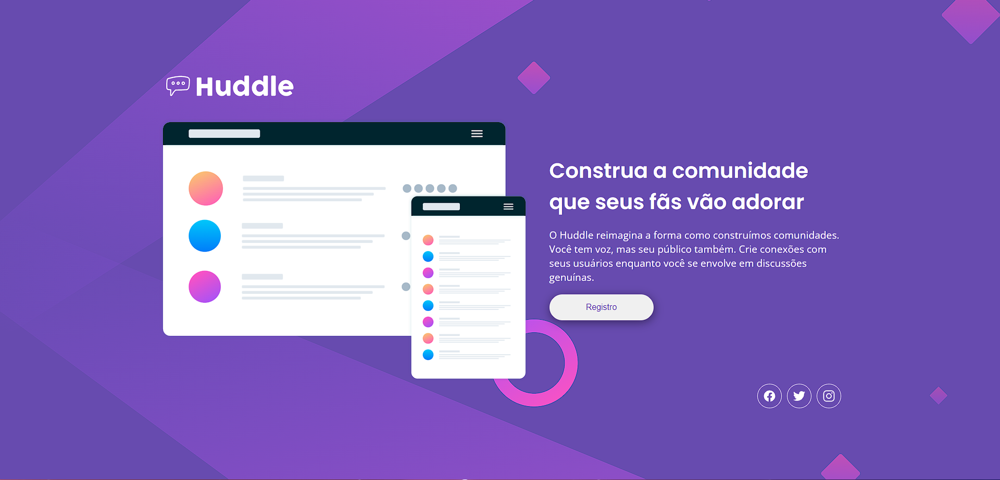
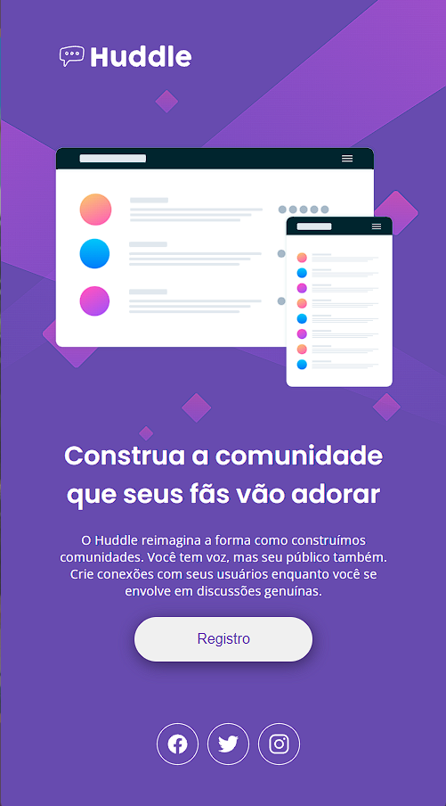

# 🚀 Quest HTML e CSS Avançado

## 🔗 Sobre o projeto

Este projeto é uma página web que mostra as habilidades dos alunos da DevQuest em HTML e CSS avançado. A página é inspirada em um design fornecido pela DevQuest, mas com algumas modificações e melhorias. A página é bonita, interativa e funcional, e pode ser acessada [aqui](https://quest-html-css-avacado.vercel.app/).

## 📝 Objetivos

O objetivo deste projeto é demonstrar o domínio dos conceitos de HTML e CSS avançado, tais como:

- Semântica: usar as tags adequadas para cada elemento da página, como main, header, divs, footer, nav e ul.
- Responsividade: adaptar o layout da página para diferentes tamanhos de tela, usando media queries, flexbox e grid.
- Animação: criar efeitos visuais dinâmicos e atraentes, transitions e transforms.

## 💻 Tecnologias

As tecnologias usadas neste projeto são:

- HTML: a linguagem de marcação que define a estrutura da página.
- CSS: a linguagem de estilo que define a aparência da página.

## 😎 Demonstração

Veja como o projeto ficou em diferentes dispositivos:

- computador
  

- telefone

